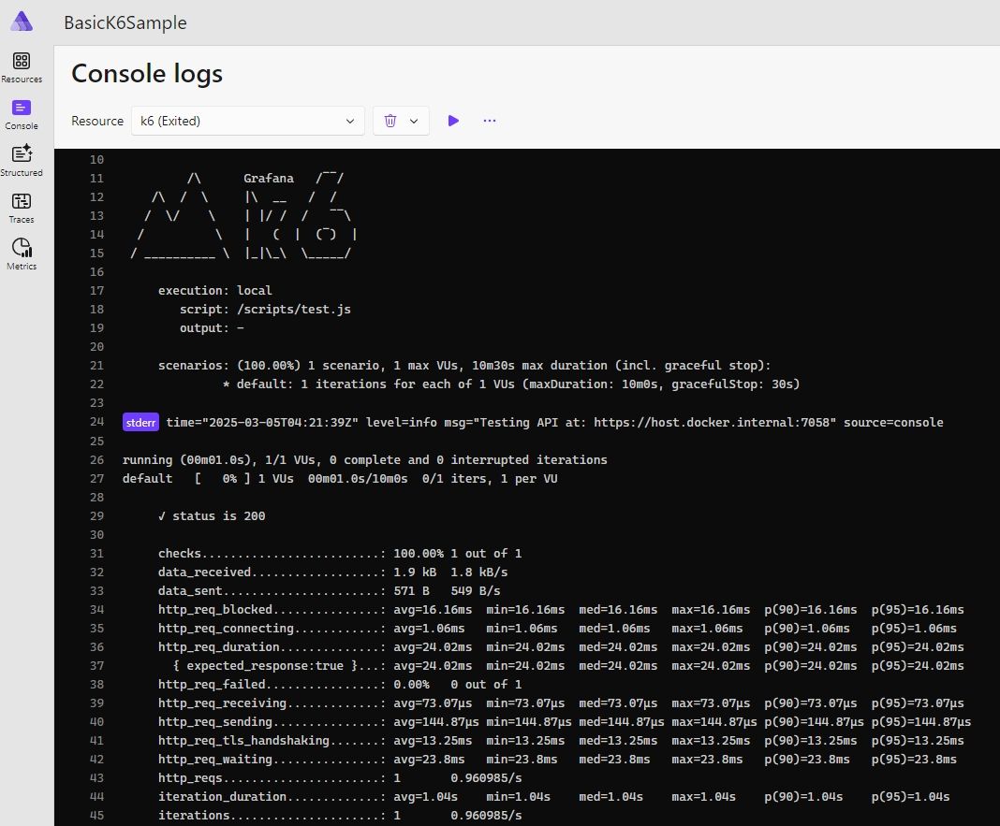

# k6-aspire-hosting

A suite of .NET libraries for integrating Grafana k6 load testing into .NET Aspire applications.

[](https://www.nuget.org/packages/CSS.K6.Hosting.Aspire)
[](https://github.com/kfrancis/k6-aspire-hosting/actions)
[](https://opensource.org/licenses/MIT)

## Overview

This repository contains a collection of libraries designed to seamlessly integrate Grafana k6 load testing into .NET Aspire applications. It enables developers to define, run, and visualize load tests as part of their Aspire application infrastructure.

## Packages

| Package | Description | NuGet | Status |
| ------- | ----------- | ----- | ------ |
| [CSS.K6.Hosting.Core](./src/K6.Hosting.Core) | Core components for k6 integration | [](https://www.nuget.org/packages/CSS.K6.Hosting.Core) | Functional |
| [CSS.K6.Hosting.Aspire](./src/K6.Hosting.Aspire) | Main integration for k6 in Aspire | [](https://www.nuget.org/packages/CSS.K6.Hosting.Aspire) | Functional |
| [CSS.K6.Hosting.Outputs.Grafana](./src/K6.Hosting.Outputs.Grafana) | Grafana dashboards for visualizing metrics | [](https://www.nuget.org/packages/CSS.K6.Hosting.Outputs.Grafana) | Functional |
| [CSS.K6.Hosting.Outputs.InfluxDB](./src/K6.Hosting.Outputs.InfluxDB) | InfluxDB support for storing metrics | [](https://www.nuget.org/packages/CSS.K6.Hosting.Outputs.InfluxDB) | Functional |
| [CSS.K6.Hosting.Outputs.Aspire](./src/K6.Hosting.Outputs.InfluxDB) | Aspire support for storing metrics | [](https://www.nuget.org/packages/CSS.K6.Hosting.Outputs.Aspire) | WIP |

## Quick Start

### 1. Install the package

```bash
dotnet add package CSS.K6.Hosting.Aspire
```

### 2. Add k6 to your Aspire application

Create a k6 test script file in your project (e.g., `scripts/load-test.js`):

```javascript
import http from "k6/http";
import { check, sleep } from "k6";

export default function () {

    // Get API information from environment
    const apiHost = __ENV.APP_HOST;
    const apiScheme = __ENV.APP_ENDPOINT_SCHEME;

    // Construct the base URL
    const baseUrl = `${apiScheme}://${apiHost}`;

    console.log(`Testing API at: ${baseUrl}`);

    const response = http.get(`${baseUrl}/weatherforecast`);

    check(response, {
        'status is 200': (r) => r.status === 200
    });

    sleep(10);
}
```

Add k6 to your Aspire host application:

```csharp
var builder = DistributedApplication.CreateBuilder(args);

// Add your API project
var apiProject = builder.AddProject<Projects.MyApi>("api");

// Add k6 for load testing
builder.AddK6("k6")
    .WithScript("./scripts/test.js")
    .WithApiEndpoint(api)
    .WaitFor(api);

await builder.Build().RunAsync();
```

Then simply run k6 on the Aspire dashboard:




## Features

- **Simple Integration**: Add k6 load testing to .NET Aspire with minimal configuration
- **API Testing**: Automatically test APIs defined in your Aspire application
- **Visualization**: Built-in support for Grafana dashboards
- **Metric Storage**: Store test results in InfluxDB for analysis
- **Docker-based**: Leverages Docker containers for consistent testing environments

## Requirements

- .NET 8.0 or .NET 9.0
- .NET Aspire
- Docker (for running containers)

## Documentation

For more detailed documentation, see the README files in each package directory:

- [K6.Hosting.Core](./src/K6.Hosting.Core/README.md)
- [K6.Hosting.Aspire](./src/K6.Hosting.Aspire/README.md)
- [K6.Hosting.Outputs.Grafana](./src/K6.Hosting.Outputs.Grafana/README.md)
- [K6.Hosting.Outputs.InfluxDB](./src/K6.Hosting.Outputs.InfluxDB/README.md)
- [K6.Hosting.Outputs.InfluxDB](./src/K6.Hosting.Outputs.Aspire/README.md)

## Examples

See the [samples](./samples) directory for sample applications demonstrating how to use these libraries.

### For visualization with Grafana:

```bash
dotnet add package CSS.K6.Hosting.Outputs.Grafana
```

### For metrics storage with InfluxDB:

```bash
dotnet add package CSS.K6.Hosting.Outputs.InfluxDB
```

## Contributing

Contributions are welcome! Please feel free to submit a Pull Request.

1. Fork the repository
2. Create your feature branch (`git checkout -b feature/amazing-feature`)
3. Commit your changes (`git commit -m 'Add some amazing feature'`)
4. Push to the branch (`git push origin feature/amazing-feature`)
5. Open a Pull Request

## References

- [Grafana K6 Documentation](https://grafana.com/docs/k6/latest/)

## License

This project is licensed under the MIT License - see the [LICENSE](LICENSE) file for details.
